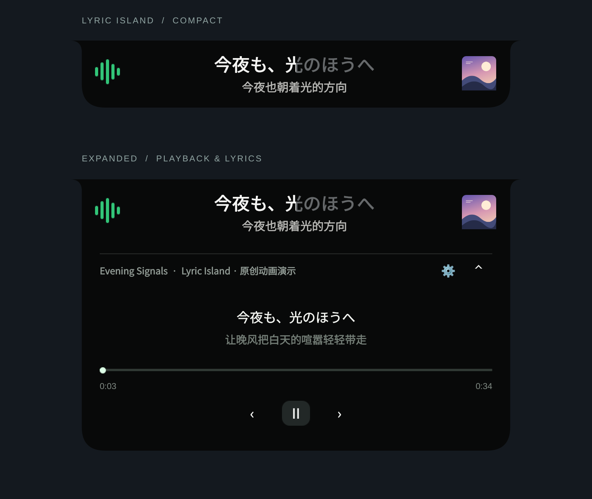
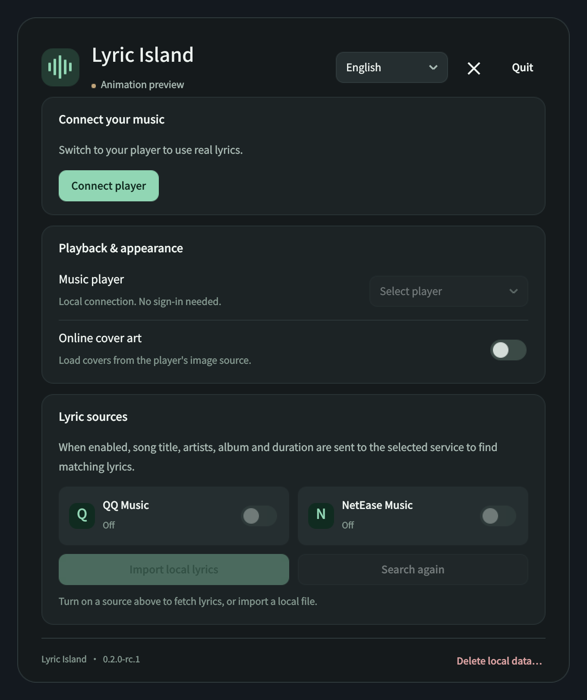

# Lyric Island · omarchy-lyricify

A lyrics panel for **Omarchy / Hyprland**. It follows your music player, shows timed lyrics at the top of the screen, and provides playback controls. Spotify on the Linux desktop is the primary player.

**Developed with reference to [Lyricify / Lyricify-App](https://github.com/WXRIW/Lyricify-App), by WXRIW / XY Wang.** Lyrics processing and matching reuse [Lyricify Lyrics Helper](https://github.com/WXRIW/Lyricify-Lyrics-Helper). This is an independent Omarchy plugin, not an official Lyricify port.



Rendered from the application with original demo lyrics and artwork. [Preview source and attribution](assets/previews/README.md).

## Features

- Local Spotify/MPRIS connection and playback controls; no separate Spotify authorization or developer account required.
- Automatic lyric matching, with manual version selection and saved timing corrections.
- QQ Music and NetEase Music sources, separately opt-in; local UTF-8 LRC, decrypted QRC, YRC and timeline JSON imports.
- Bilingual lines and real word highlighting when the source contains word timestamps. Plain LRC stays line-synced.
- Drag horizontally, snap to screen center, and preserve position. Adjust width, monitor, fullscreen visibility and pause behavior in settings.
- English / Simplified Chinese settings, optional online artwork, local cache and explicit data cleanup.

## Install from source

**This is a local release candidate. There is no public binary download or marketplace installation yet.** Source installation currently requires Linux x86_64, an Omarchy desktop with Quickshell, the .NET SDK specified in [global.json](global.json), Python 3 and Make. The installed backend includes its runtime, so it does not need the SDK afterward.

Run these commands from the repository root in your graphical session:

```sh
make stop
make install-local
omarchy-shell shell rescanPlugins
omarchy plugin enable kuryrc.lyricify
```

The installer builds and verifies the backend, copies the plugin to your Omarchy plugin directory, and adds **Lyric Island** to the application launcher. It preserves your settings and bar layout. Build and test dependencies are listed in [CONTRIBUTING](CONTRIBUTING.md#build-and-verify).

For an existing installation, disable it with `omarchy plugin disable kuryrc.lyricify` before repeating these steps. If the old interface remains after installation, follow [Reloading an updated plugin](docs/troubleshooting.md#reloading-an-updated-plugin).

### Compatibility and known limitations

The development desktop uses Arch Linux x86_64, Omarchy 4.0.3, Hyprland 0.56.2, Quickshell 0.3.1 and Qt 6.11.2. This is a tested environment, not a minimum-version guarantee.

- Spotify desktop 1.2.96.518 is used for playback integration. Playback timing after seeking has not met the synchronization target; precise alignment with audible output is still being investigated.
- Track and lyric recovery after restarting Spotify or resuming from sleep has not been fully verified.
- Continuous ten-minute animation performance, actual frame presentation and physical display changes remain unverified.
- The application launcher's “Launching Lyric Island” message can remain visible until its timeout even after the island opens. The shell does not treat the plugin's layer surface as a normal application window.
- mpv 0.41.0 with mpv-mpris 1.2 has been checked for playback, pause, seek and exit detection. Its native island UI and audio output have not been checked. Other MPRIS players may work but are not certified.

The plugin follows the session reported by the local player. It does not discover or switch Spotify Connect output devices. Browser-specific integration, automatic translation and Japanese romanization are outside the current scope.

## Using the island

1. Start Spotify, sign in there if needed, and play a song.
2. Open **Lyric Island** from the application launcher. Right-click the island or use its gear button to open settings.
3. Under **Lyric sources**, enable QQ Music or NetEase Music. Both are off by default. The plugin sends song metadata to the selected service and automatically uses a suitable match. You can also import a local lyric file.

Lyric availability depends on the song, region and service. When a match is unsuitable, choose another version in settings. See [Troubleshooting](docs/troubleshooting.md#lyrics-do-not-appear) for lyric status messages.

| Action | Result |
| --- | --- |
| Click the island | Expand lyrics and playback controls; use the chevron to collapse |
| Drag empty space horizontally | Move along the top edge, snap near screen center and save the position |
| Open **Island display** | Change width, monitor, fullscreen visibility or pause behavior; center or restore the default position |
| Adjust lyric timing in settings | Positive offsets show lyrics earlier; the player position stays unchanged |
| Choose **Quit** | Close the plugin while Spotify and the desktop shell keep running; reopen it from the application launcher |

The default position is center-right. The plugin does not move the existing clock or weather widgets; adjust its position if they overlap. By default it hides in fullscreen and collapses five seconds after pausing. Remote cover art is a separate, opt-in setting.

<details>
<summary>Settings preview</summary>



</details>

## Uninstall

Normal removal keeps settings, imported lyrics and timing corrections:

```sh
omarchy plugin disable kuryrc.lyricify
omarchy plugin remove kuryrc.lyricify
```

For a complete cleanup, use **Delete local data** in settings before removal. This deletes imports, timing corrections, settings, cache and the downloaded backend. To clean up after removing the plugin, stop any preview and run this from a retained source checkout:

```sh
python3 scripts/runtime.py purge --confirm-user-data-deletion
```

The application launcher entry is hidden after removal. Its remaining desktop file can be removed manually; [privacy and local data](docs/privacy.md) lists its location.

## Privacy

Playback communication stays on the local session bus. Enabling a lyric source sends supported song metadata directly to that service; no private relay or telemetry is used. [Network and data details](docs/privacy.md).

## Help and development

- [Troubleshooting](docs/troubleshooting.md): missing lyrics, startup, timing and bug reports.
- [Contributing](CONTRIBUTING.md): development setup, code layout and tests.
- [Release guide](docs/release.md): packaging and publication for maintainers.

## Credits and license

**Lyricify — WXRIW / XY Wang** is the source of the Dynamic Lyrics Island reference. The upstream [creative-work declaration](https://github.com/WXRIW/Lyricify-App#lyricify-%E5%8E%9F%E5%88%9B) uses **CC BY-SA 4.0**. Our adapted visual layer and previews use the same license, with changes and attribution recorded in [NOTICE](NOTICE).

Original backend/core logic, tools and tests are **MIT**. **Lyricify Lyrics Helper 0.2.0** and its modified matching subset remain **Apache-2.0**, with the upstream license, pinned source and modification notices preserved. Other dependencies retain their own licenses. See [LICENSE](LICENSE) for file-level scope and [THIRD_PARTY](THIRD_PARTY.md) for the complete inventory.

No Lyricify application binaries, logos, screenshots, album covers or commercial song lyrics are bundled. This project is not affiliated with or endorsed by Lyricify, Spotify, QQ Music, NetEase Music or Omarchy.
