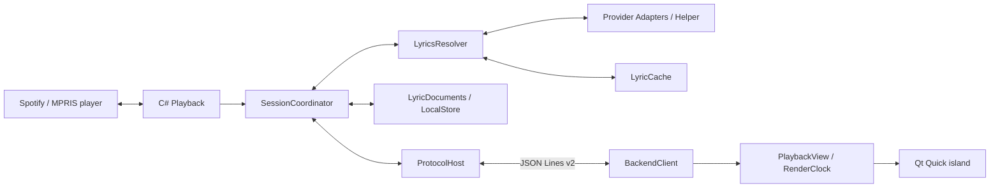

# Architecture

Lyric Island uses QML/Qt Quick for presentation and one C#/.NET process for local playback and lyrics I/O. This document describes responsibilities and behavior that changes must preserve. Message fields are defined in [protocol](protocol.md), acceptance criteria in [testing](testing.md), and current limitations in the [README](../README.md#compatibility-and-known-limitations).

## Modules and ownership

| Module | Interface and responsibility |
| --- | --- |
| Playback | Discover/select MPRIS instances, publish playback snapshots, execute scoped controls. Owns D-Bus sampling, reconnects and capability checks. Does not depend on lyric providers. |
| SessionCoordinator | Attribute work to player/track/resolution, lock the current lyric document, commit results and expose session snapshots. Playback and lyric failure states remain independent. |
| LyricsResolver | Resolve enabled online providers and cache; fetch a selected candidate. Owns bounded fallback and cancellation. It does **not** own local import or manual-selection persistence. |
| LyricDocuments / LocalStore | Validate/import timelines, restore/save manual selections and version-bound offsets. Preserve invalid stored records and report `storage_error`. |
| LyricCache | Rebuildable positive/negative cache, expiry and eviction. Failed cache writes preserve usable lyrics. |
| ProtocolHost | Handshake, request deduplication, bounded input/output and concurrent dispatch. stdout contains protocol messages only. |
| BackendClient / RuntimeBootstrap | Own one child process and consistent preparation state, handshake and bounded restart. Runtime filesystem/download work is in `scripts/runtime.py`. |
| PlaybackView / RenderClock | Interpolate between backend position samples using a local monotonic clock. Apply seeks and reconnects as discontinuities. |
| UiPreferences / PositionStore | Defaults and persistent user overrides; drag position has a separate store for real/demo modes. |
| Release | `VERSION` owns the product version; .NET reads it at build time, `make version` generates QML and manifest metadata. Protocol and data schema versions remain independent. |

ProviderCatalog lists supported providers, their display names and allowed transport domains. Each provider implements ILyricProvider; tests can substitute a local provider without changing the resolver. Playback integration tests run the production backend against an isolated D-Bus service.

### Why playback I/O stays in the backend

Player discovery, controls, position sampling and reconnect handling need to agree on the current player and track. Keeping them in one process gives that state one owner. A split design, with QML controlling the player and C# sampling positions, would require both sides to track the same identities and discard stale work consistently.

The tradeoff is that a backend crash temporarily disables island controls. Spotify itself continues playing. The UI retains its last information, freezes lyric highlighting and makes a bounded number of restart attempts before offering retry. Playback commands are not replayed across restarts. A lyric-provider failure stays within its task and must not cause this process-wide degradation.

## Terms

| Term | Meaning |
| --- | --- |
| Player instance | One running music app, identified by its unique D-Bus owner. Reopening the app creates a new instance. |
| Track identity | A specific recording as identified by the player. A studio and live version with the same title are different tracks. |
| Playback session | The selected player instance and its state. It does not identify the physical audio output, which may be remote. |
| Track generation | A session-local counter incremented on track changes, used to reject old asynchronous results. |
| Lyric document | A timeline containing original text, any source-provided translation, and line or word timestamps. |
| Lyric version | A particular source's lyric content and timing. It is distinct from the song's recording version. |
| Lyric selection | The document chosen for the current track, automatically or by the user. |
| Lyric offset | A correction applied to the selected timeline. Positive means earlier; it does not change player position. |
| Position sample | A player-reported position and its observation time. It is not a measurement of audible output. |

## Playback and rendering

C# owns MPRIS metadata, capabilities and position observations. Unique D-Bus owners identify running player instances; a changed player/track invalidates old work. Strong track identity permits persistent manual selection. Weak metadata identity only supports session-local selection.

Player selection defaults to Spotify and remains on the chosen instance while it is paused. Controls target the displayed instance; commands with an old player or track scope are rejected. Player exit hides the island. Reconnection and recovery must obtain a fresh sample before resuming highlighting. The app follows the local player's reported session without claiming to know or switch a Spotify Connect output device.

QML anchors received positions to a monotonic clock, interpolates locally and requests resynchronization after discontinuities. Paused or hidden static content does not keep a frame loop running. Position samples, lyric timestamps, compositor presentation and audible output are different measurements.

### Display behavior

The island uses a fixed transparent layer surface with an input region limited to visible content. It stays at the top edge, initially center-right. It does not change the bar layout or automatically measure the clock and weather widgets to avoid overlap. Settings use a separate window with keyboard focus; ordinary lyric display does not take keyboard focus.

- Dragging is horizontal, with an 8 logical-pixel threshold separating a drag from a click. Vertical motion neither changes height nor activates a click after crossing that threshold. The center snaps within 16 pixels and releases beyond 28 pixels; edges retain a 16-pixel margin. Playback controls and the seek bar do not start a drag.
- Position is saved on release. Demo and live positions are separate. One monitor hosts the island; a disconnected configured monitor falls back to an available output.
- Hover exposes controls; clicking expands the view. Long lines scroll within the configured width. Text and metrics change on document/line changes, not on every frame.
- Pausing stops lyric time and collapses the view after the configured delay, five seconds by default. Resuming restores the lyric view. Fullscreen hiding considers the island's output and current workspace and can be disabled in settings.
- Gaps of at most 1.2 seconds retain the completed line without advancing its highlight. Longer gaps and the end of lyrics show song information. Word masks use real timestamps; ordinary LRC remains line-synced. Translation is shown only when supplied by the source.

## Lyrics and failure isolation

Resolution order: saved manual selection, valid cache, enabled providers. Turning off online sources cancels requests but keeps usable local documents. A locked document is not silently replaced by later results. Commit checks include scope and resolution identity even after cancellation.

Automatic lookup requires usable song metadata; known unsupported content does not trigger a search. Online providers use optional, unofficial QQ/NetEase interfaces without user cookies. Failure or an uncertain match falls back to song information and a status message, with manual selection/import available. Source availability and remote artwork permissions are separate; see [privacy](privacy.md).

ArtistNames reuses the pinned Helper artist alias table before search and comparison. LyricMatchPolicy adapts the pinned upstream scoring: recording-version conflicts are rejected, album differences rank candidates, and the default automatic floor is PrettyHigh with title/artist grades at least High, primary-artist compatibility and duration difference below 3500 ms. Scores are grades, not probabilities. Compatibility changes and provenance are in [UpstreamMatching](../backend/LyricIsland.Backend/Lyrics/UpstreamMatching/README.md).

Duplicate candidates or alternate album releases alone do not require manual selection. Ranking is stable, preferring stronger metadata and closer duration. Missing collaborators may be accepted when the primary artists agree; a shared guest artist alone is insufficient. Empty artist data and conflicting recordings remain ineligible for automatic selection. A track's manual selection and offset are not automatically reused across different music apps or lyric versions.

A broken word timeline may fall back to the **same candidate's** valid line timeline. Content failures may try at most three eligible candidates; network errors, rate limits and cancellation stop that round. Only a real search with no candidates is negative-cached.

User-file import opens only a regular local file, checks the opened descriptor and bounds input to 900,000 bytes. Linux nonblocking open prevents FIFO waits; descriptor inspection avoids a path-check/open race. Reads and parsing run outside the session lock with cancellation and a deadline. Scope/resolution are rechecked before the short local save/commit. Stored-selection permission/JSON/timeline errors become lyric `storage_error`, not playback disconnection.

## Persistent data

| Data | Owner / location below XDG roots |
| --- | --- |
| UI language, artwork, display overrides | UiPreferences; `config/omarchy-lyricify/ui.json` |
| Player and online sources | C# LocalStore; `config/omarchy-lyricify/settings.json` |
| Drag position | PositionStore; `state/omarchy-lyricify/position.json`; demo uses `preview-position.json` |
| Manual lyrics and offsets | LyricDocuments; `data/omarchy-lyricify/` |
| Download consent and active runtime | Python runtime; `state/omarchy-lyricify/runtime.json` |
| Installed runtime versions | Python runtime; `data/omarchy-lyricify/runtimes/` |
| Rebuildable lyrics cache | LyricCache; `cache/omarchy-lyricify/` |

Shipped defaults live in `assets/defaults.json`. Legacy installation-tree `config.json` is read once into XDG overrides; existing overrides win. After a durable write, the old file moves to an XDG backup so purge/restart cannot import it again. Confirmed purge also removes a remaining pre-migration config. Normal removal retains XDG data. Explicit confirmed purge stops the child first, removes owned data and resets in-memory preferences/readiness; preparation remains accessible.

A native plugin load registers a desktop entry through the same `launch.py --register` used by local installation. `TryExec` points to the installed executable script: removing its checkout hides the entry, and reinstalling restores it. Disabling the plugin retains the entry so it can be enabled/opened again. No Omarchy post-install hook is assumed.

## Protocol and distribution

Only `--stdio` / JSON Lines v2 is supported. Input is limited to 1 MiB, output queue to 256 messages, concurrent requests to 32 and deduplication records to 256.

Runtime preparation uses the exact reviewed manifest URL, size and SHA-256. Activation validates architecture and a real handshake. QML consumes a settled runtime result instead of inferring readiness from assignment order. Compatible fallback requires the same backend version and protocol.

Original logic is MIT; the attributed visual layer and previews are CC BY-SA 4.0; Helper and its imported matching subset remain Apache-2.0. See [LICENSE](../LICENSE), [NOTICE](../NOTICE) and [THIRD_PARTY](../THIRD_PARTY.md).
